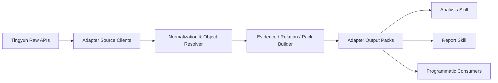
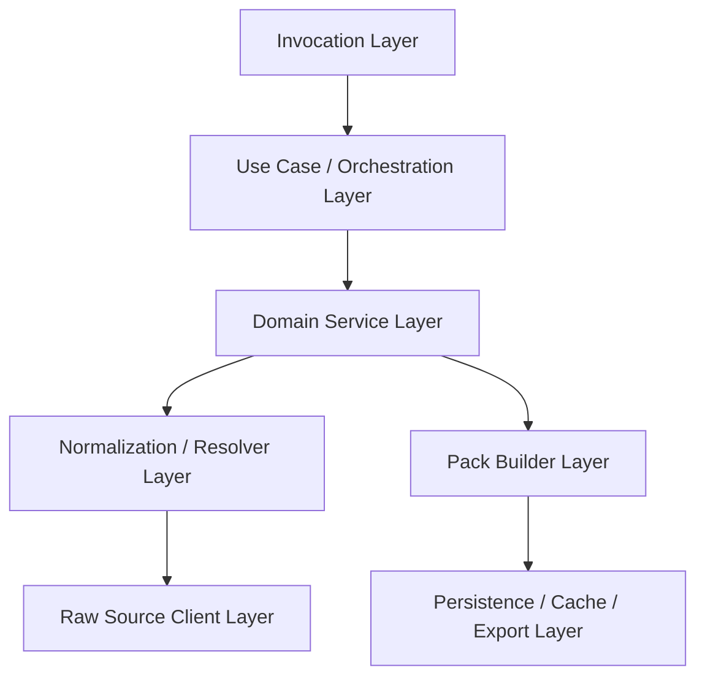

# 听云 Adapter 项目架构设计文档

生成时间：2026-04-04  
项目目录：`/Users/wangrundong/work/mywork/tingyun_adapter`  
关联文档：

- `adapter_skill_blueprint.md`
- `tingyun_system_skeleton_diagnostic_playbook.md`
- `tingyun_manual_context_and_component_mapping.md`
- `api_analysis_priority.md`
- `api_report_shortlist.md`

## 1. 文档定位

这是一份面向落地建设的 Adapter 项目架构设计文档。

它解决的问题不是“要不要做 adapter”，而是：

- 这个 adapter 项目应该长成什么样
- 项目内部应该怎么分层和拆模块
- 如何调用
- 输入和输出应该长什么样
- 怎样覆盖当前已掌握的核心诊断能力
- 怎样让后续 report skill 能稳定消费

这份文档的目标是让后续进入实现阶段时，团队可以围绕统一结构推进，而不是继续在“原始抓包 + 临时脚本 + 页面上下文”之间来回切换。

## 2. 背景与问题定义

当前已经掌握的听云接口，本质上不是零散页面请求，而是一套围绕以下系统骨架展开的诊断能力：

`业务系统 -> 应用 / 实例 -> 事务 / action -> trace -> 下游组件（Database / NoSQL / MQ / 连接池）`

但是原始接口存在几个天然问题：

- 页面驱动明显，很多调用只有放在页面链路中才容易理解
- 对象层级深，跨接口关系复杂
- 字段表达不一致，例如：
  - `response` / `respTime` / `responseTime`
  - `totalResponse` / `totalResptime`
  - 数值型 `traceId` 与 GUID 型 trace key 混用
  - `throught` 拼写不统一
  - `opName` 存在 `tyBase64_` 编码
- 很多价值不在单次接口，而在一条完整下钻链路中

因此需要一层 adapter，把原始平台接口重组织为：

- 面向对象
- 面向诊断
- 面向报告
- 面向大模型理解

的结构化分析输入。

## 3. 架构目标

### 3.1 总目标

构建一层面向分析与报告场景的数据整理层，使上层 skill 不再直接面向原始接口和页面逻辑。

### 3.2 具体目标

adapter 至少应达成以下能力：

1. 统一对象模型
2. 统一关键键模型
3. 统一字段表达
4. 统一证据表达
5. 统一下钻路径表达
6. 将原始接口结果重组为稳定的 pack
7. 支持脚本、批处理、SDK、服务化多种调用方式
8. 具备演进能力和 schema 版本控制能力

### 3.3 非目标

当前阶段 adapter 不承担：

- 完整自动归因
- 最终报告自动写作
- 平台前端页面复刻
- 听云所有接口的完全抽象
- 巡检规则全集覆盖

## 4. 系统上下文

从整体上看，后续体系应该分成两层：

1. `adapter/adapt`
2. `analysis/report skill`

其中：

- `adapter` 向下连接听云平台原始接口
- `skill` 向上消费 adapter 产出的 pack，做分析、解释、成文

### 4.1 总体上下文图



## 5. 架构原则

### 5.1 面向对象，不面向页面

adapter 输出不以“页面卡片”或“某个 tab 的响应”作为核心单位，而以对象与诊断包作为核心单位。

### 5.2 面向诊断，不面向接口透传

上层拿到的应该是：

- `system_snapshot`
- `action_hotspot_pack`
- `trace_case_pack`
- `database_component_pack`

而不是：

- “请自己调用 `webaction/overview`”

### 5.3 事实优先，解释后置

adapter 负责：

- observed facts
- normalized facts
- lightly derived facts

不负责：

- 最终强归因
- 最终结论性判断

### 5.6 候选筛选允许，最终判断后置

结合最近的实践，adapter 可以承担：

- 候选对象筛选
- 可疑信号提取
- 面向单对象的 fact sheet 组装

但不应承担：

- 最终问题定性
- 最终优先级结论
- 最终优化建议

换句话说：

- adapter 负责“把值得看的对象组织出来”
- skill 负责“解释这些对象为什么重要”

### 5.4 可回溯

每个对象和 pack 中的重要字段都应该能回溯到：

- 来源接口
- 请求参数
- 原始字段
- 抽取规则

### 5.5 Schema 稳定优先于字段完美

面对原始接口字段不一致问题，adapter 的首要任务不是完美统一每个细枝末节，而是先形成：

- 稳定的输出结构
- 可兼容字段差异的归一化规则

## 6. 项目分层架构

推荐采用六层结构。

### 6.1 分层概览



### 6.2 第 1 层：Invocation Layer

职责：

- 提供外部调用入口
- 接收用户上下文和输入参数
- 选择执行哪个 use case

建议形式：

- Python SDK
- CLI
- Batch Job
- 可选 HTTP Service

不负责：

- 直接拼原始接口
- 直接做字段归一化

### 6.3 第 2 层：Use Case / Orchestration Layer

职责：

- 编排一条诊断链路
- 决定先调哪个对象，再调哪个下游
- 管理分页、重试、缓存命中、下钻策略

典型 use case：

- `build_system_snapshot`
- `build_action_hotspot_pack`
- `build_trace_case_pack`
- `build_database_component_pack`
- `build_report_fact_pack`
- `build_diagnostic_candidate_pack`
- `build_action_fact_sheet`
- `build_trace_fact_sheet`

### 6.4 第 3 层：Domain Service Layer

职责：

- 面向领域对象组织逻辑
- 把多个原始来源聚合为一个领域对象

典型 service：

- `BizSystemService`
- `ActionService`
- `TraceService`
- `DatabaseService`
- `NoSQLService`
- `ConnectionPoolService`
- `EvidenceService`

### 6.5 第 4 层：Normalization / Resolver Layer

职责：

- 字段归一化
- 键统一
- 编码解码
- 对象关联解析

典型模块：

- `field_normalizer`
- `trace_key_resolver`
- `component_key_resolver`
- `op_name_decoder`
- `relation_resolver`

### 6.6 第 5 层：Raw Source Client Layer

职责：

- 负责和听云原始接口交互
- 封装请求细节
- 保留原始请求/响应

典型 client：

- `WebActionClient`
- `GraphClient`
- `TraceClient`
- `DatabaseClient`
- `NoSQLClient`
- `ConnectionClient`
- `LogTraceClient`

### 6.7 第 6 层：Candidate / Fact Sheet Layer

这是下一阶段需要强调的一层能力形态，虽然仍然落在 use case / pack builder 中，但职责上值得单独说明。

职责：

- 从 snapshot、list、overview、analysis 中筛选候选对象
- 把特定 action / trace / component 组织成可直接被 skill 消费的 fact sheet
- 输出 suspect signals，而不是最终判断

典型产物：

- `diagnostic_candidate_pack`
- `action_fact_sheet`
- `trace_fact_sheet`

## 6.8 当前已验证的工程修正

最近一轮代码实践已经验证了几项重要修正：

1. pack 输出中的 token 默认脱敏，不再暴露明文凭据
2. `connection/chart` 的 tooltip 解析优先于 `y` 值，修正了 `latest_used_connections` 抽取错误
3. pack 中开始统一输出 `suspect_signals`
4. adapter 已具备“候选对象 + fact sheet”两类新增输出形态

### 6.7 第 6 层：Pack Builder / Persistence Layer

职责：

- 把领域对象打包成稳定结构
- 存储 pack
- 输出 pack
- 缓存中间结果

典型模块：

- `pack_builders`
- `pack_repository`
- `evidence_repository`
- `cache_store`
- `exporter`

## 7. 推荐项目目录结构

建议后续项目目录类似这样：

```text
tingyun_adapter/
  README.md
  pyproject.toml
  src/
    tingyun_adapter/
      __init__.py
      config/
        settings.py
        constants.py
      domain/
        models/
          biz_system.py
          application.py
          instance.py
          action.py
          trace.py
          component.py
          evidence.py
          pack.py
        enums.py
        value_objects.py
      clients/
        base.py
        webaction_client.py
        graph_client.py
        trace_client.py
        database_client.py
        nosql_client.py
        connection_client.py
        logtrace_client.py
      normalizers/
        field_normalizer.py
        metric_normalizer.py
        trace_key_resolver.py
        component_key_resolver.py
        op_name_decoder.py
        relation_resolver.py
      services/
        biz_system_service.py
        action_service.py
        trace_service.py
        database_service.py
        nosql_service.py
        connection_service.py
        evidence_service.py
      usecases/
        build_system_snapshot.py
        build_action_hotspot_pack.py
        build_trace_case_pack.py
        build_database_component_pack.py
        build_nosql_component_pack.py
        build_connection_pool_pack.py
        build_report_fact_pack.py
      packs/
        builders/
          system_snapshot_builder.py
          action_hotspot_builder.py
          trace_case_builder.py
          database_component_builder.py
          nosql_component_builder.py
          connection_pool_builder.py
          report_fact_builder.py
        schemas/
          pack_envelope.py
          system_snapshot.py
          action_hotspot_pack.py
          trace_case_pack.py
          database_component_pack.py
          nosql_component_pack.py
          connection_pool_pack.py
          report_fact_pack.py
      storage/
        cache.py
        repositories.py
        file_store.py
      invocation/
        sdk.py
        cli.py
        batch.py
        http_api.py
      utils/
        time_window.py
        json_tools.py
        retry.py
        ids.py
  tests/
    unit/
    integration/
    golden/
```

## 8. 运行模式设计

adapter 至少建议支持三种运行模式。

### 8.1 SDK 模式

适合：

- Python 代码内直接调用
- 后续被 skill 直接作为库依赖

特点：

- 类型友好
- 便于单测
- 更适合程序化集成

### 8.2 CLI 模式

适合：

- 手工调试
- 生成中间 pack 文件
- 巡检任务脚本

特点：

- 易操作
- 易串 shell
- 易接自动任务

### 8.3 Batch 模式

适合：

- 周期性为某个 bizSystem 产出一批 pack
- 用于后续 report skill 的批量输入

特点：

- 支持多个 bizSystem
- 支持固定时间窗口
- 支持将中间结果落盘

### 8.4 可选 HTTP Service 模式

适合：

- 未来被其他服务调用
- 和 workflow/agent 系统做远程集成

当前阶段不是必须，但设计上应预留。

## 9. 核心输入模型设计

Adapter 的输入建议分三层：

1. 上下文输入
2. 对象选择输入
3. 诊断策略输入

### 9.1 上下文输入 `AnalysisContext`

建议字段：

- `base_url`
- `auth`
  - `token`
- `biz_system_id`
- `time_window`
  - `end_time`
  - `period_minutes`
- `lang`
- `timezone`

示例：

```json
{
  "base_url": "http://169.169.173.25:8080",
  "auth": {
    "token_env": "TINGYUN_TOKEN"
  },
  "biz_system_id": 1065,
  "time_window": {
    "end_time": "2026-04-03 12:20",
    "period_minutes": 30
  },
  "lang": "zh_CN",
  "timezone": "Asia/Shanghai"
}
```

### 9.2 对象引用输入

建议引入统一引用对象，而不是到处散 `actionId`、`componentName`。

#### `ActionRef`

- `biz_system_id`
- `application_id`
- `action_id`
- `action_type`

#### `TraceRef`

- `biz_system_id`
- `trace_id_numeric`
- `query_timestamp`
- 可选 `action_guid`

#### `DatabaseComponentRef`

- `biz_system_id`
- `component_type=Database`
- `component_subtype`
- `component_name`

#### `NoSQLComponentRef`

- `biz_system_id`
- `component_type=NoSQL`
- `component_subtype`
- `component_name`

#### `ConnectionPoolRef`

- `biz_system_id`
- `application_id`
- `instance_id`
- `metric_category`

### 9.3 诊断策略输入

例如：

- `HotspotPolicy`
- `TraceSelectionPolicy`
- `ComponentRankingPolicy`
- `EvidencePolicy`

#### `HotspotPolicy`

- `sort_by`
- `secondary_sort_by`
- `limit`
- `include_zero_error`

#### `TraceSelectionPolicy`

- `strategy`
  - `slowest`
  - `newest`
  - `highest_error`
- `limit`

#### `EvidencePolicy`

- `include_raw_request`
- `include_raw_response_excerpt`
- `max_evidence_per_fact`

## 10. 核心输出模型设计

输出应采用统一 Envelope + Payload 的方式。

### 10.1 通用包裹层 `PackEnvelope`

建议所有 pack 都包在统一外层里：

```json
{
  "schema_version": "v1",
  "pack_type": "system_snapshot",
  "generated_at": "2026-04-03T22:00:00+08:00",
  "context": {...},
  "payload": {...},
  "meta": {
    "adapter_version": "0.1.0",
    "source_count": 5,
    "evidence_count": 18
  }
}
```

### 10.2 核心 Pack 类型

推荐首批支持：

- `system_snapshot`
- `action_hotspot_pack`
- `trace_case_pack`
- `database_component_pack`
- `nosql_component_pack`
- `connection_pool_pack`
- `report_fact_pack`

## 11. 关键 Pack 的输入输出定义

下面这部分是整个架构文档里最关键的内容之一：明确每个能力的调用方式、输入输出和语义边界。

## 11.1 `build_system_snapshot`

### 作用

构建某个业务系统在某个时间窗内的总体运行情况快照。

### 输入

- `AnalysisContext`

### 来源接口

- `application/business/overview/*`
- `health/healthLevelStatistics`
- `application/charts/response`
- `application/charts/throught`
- `application/charts/error`
- 可选 `application/charts/apdex`

### 输出

- `system_snapshot`

### 输出结构建议

```json
{
  "biz_system": {
    "id": 1065,
    "name": "集团法务"
  },
  "overview": {
    "apdex": 0.97,
    "application_count": 2,
    "instance_count": 3,
    "host_count": 2,
    "response_time_ms": 122,
    "throughput": 8.39,
    "success_count": 15104,
    "error_rate": 0.0
  },
  "health": {...},
  "trends": {...},
  "evidence": [...]
}
```

### 典型 use case

- 写“系统总体运行情况”
- 写“健康度与趋势变化”
- 给 report skill 提供开头概述数据

## 11.2 `build_action_hotspot_pack`

### 作用

找出业务系统中的重点 action，并补充 action 级摘要信息。

### 输入

- `AnalysisContext`
- `HotspotPolicy`

### 来源接口

- `webaction/list/actionList`
- `webaction/overview`
- 可选 `webaction/charts/*`

### 输出

- `action_hotspot_pack`

### 输出结构建议

```json
{
  "ranking_policy": {
    "primary": "response_time_ms",
    "secondary": "slow_count"
  },
  "hotspots": [
    {
      "action_ref": {
        "biz_system_id": 1065,
        "application_id": 1644,
        "action_id": 13220,
        "action_type": "TX"
      },
      "action": {
        "name": "SpringController/...",
        "response_time_ms": 2967,
        "slow_count": 2,
        "count": 2,
        "total_response_time_ms": 5934
      },
      "overview": {...},
      "selection_reason": [
        "top_1_by_response_time"
      ],
      "evidence": [...]
    }
  ]
}
```

### 典型 use case

- 写热点 action / 热点事务
- 为 trace 分析提供入口 action

## 11.3 `build_trace_case_pack`

### 作用

围绕一个 action 或一个 trace 构建典型追踪案例包。

### 输入

两种方式都应支持：

1. `ActionRef + TraceSelectionPolicy`
2. `TraceRef`

### 来源接口

- `graph/query/overview` 中 `metric=trace_current_overview`
- `action/trace/detail`
- `action/trace/detail/exceptions`
- `action/trace/callTree`
- `action/trace/detail/snapshotTimeInfo`
- `action/trace/detail/queryAgentVersionInfo`
- `data/logTrace/searchLogTrace`

### 输出

- `trace_case_pack`

### 输出结构建议

```json
{
  "selector": {
    "strategy": "slowest"
  },
  "trace_case": {
    "trace_ref": {...},
    "trace_summary": {...},
    "suspected_problems": [...],
    "exceptions": [...],
    "call_tree_summary": {...},
    "timeline_summary": {...},
    "environment_summary": {...},
    "logs_summary": {...}
  },
  "drilldown_path": [...],
  "evidence": [...]
}
```

### 典型 use case

- 典型问题请求案例分析
- 问题探究链路组织
- 为报告提供证据案例

## 11.4 `build_database_component_pack`

### 作用

围绕一个 Database 组件，整理从组件概览、慢 SQL、受影响 action、相关 trace 到连接池状态的完整分析包。

### 输入

- `AnalysisContext`
- `DatabaseComponentRef`
- 可选 `ComponentRankingPolicy`

### 来源接口

- `Database/list`
- `Database/info`
- `Database/analysis`
- `component/database/actionList`
- `component/database/actionTraceList`
- `graph/component/queryDataBaseGraph`
- `connection/list`
- `connection/database/chart`

### 输出

- `database_component_pack`

### 输出结构建议

```json
{
  "component": {
    "type": "Database",
    "subtype": "MySQL",
    "name": "10.190.22.21:3306"
  },
  "summary": {...},
  "top_operations": [...],
  "top_impacted_actions": [...],
  "top_related_traces": [...],
  "topology_summary": {...},
  "connection_pool_summary": {...},
  "evidence": [...]
}
```

### 典型 use case

- 找出重点 Database 组件
- 找出慢 SQL
- 找出受影响 action
- 找出关联 trace

## 11.5 `build_nosql_component_pack`

### 作用

围绕一个 NoSQL 组件构建分析包。

### 输入

- `AnalysisContext`
- `NoSQLComponentRef`

### 来源接口

- `NoSQL/list`
- `NoSQL/overview`
- `NoSQL/analysis`
- `NoSQL/trace`
- `NoSQL/errorTypeAmount`
- `graph/component/queryNosqlGraph`

### 输出

- `nosql_component_pack`

### 典型 use case

- 找重点 Redis 节点
- 找热操作
- 看 NoSQL 节点与应用关系

## 11.6 `build_connection_pool_pack`

### 作用

构建连接池状态与趋势包。

### 输入

- `AnalysisContext`
- `ConnectionPoolRef`

### 来源接口

- `connection/list`
- `connection/chart`
- `connection/database/chart`

### 输出

- `connection_pool_pack`

### 典型 use case

- 判断是否有池耗尽风险
- 判断连接时间是否异常

## 11.7 `build_report_fact_pack`

### 作用

输出面向 skill 的总分析事实包。

### 输入

- `AnalysisContext`
- 可选：
  - `HotspotPolicy`
  - `TraceSelectionPolicy`
  - `EvidencePolicy`

### 来源

组合多个 pack：

- `system_snapshot`
- `action_hotspot_pack`
- 可选 `trace_case_pack`
- 可选 `database_component_pack`
- 可选 `nosql_component_pack`
- 可选 `connection_pool_pack`

### 输出

- `report_fact_pack`

### 用途

- 给报告 skill 做统一输入
- 给分析 skill 做统一上下文输入

## 12. Raw Client 设计

Raw client 层是 adapter 的基础，设计时需要保证：

- 请求封装统一
- 重试统一
- Header 管理统一
- 调试信息可回溯

### 12.1 `BaseClient`

建议负责：

- base_url
- token
- lang
- 超时
- 重试
- 请求日志
- 错误转换

### 12.2 Client 划分建议

#### `WebActionClient`

负责：

- `webaction/list/actionList`
- `webaction/overview`
- `webaction/charts/*`
- `webaction/performance/breakdown*`

#### `GraphClient`

负责：

- `graph/query/overview`
- `graph/query/diagram`
- `graph/information`
- `graph/component/*`

#### `TraceClient`

负责：

- `action/trace/detail`
- `action/trace/detail/exceptions`
- `action/trace/callTree`
- `action/trace/detail/snapshotTimeInfo`
- `action/trace/detail/queryAgentVersionInfo`

#### `DatabaseClient`

负责：

- `Database/*`
- `component/database/*`

#### `NoSQLClient`

负责：

- `NoSQL/*`

#### `ConnectionClient`

负责：

- `connection/*`

#### `LogTraceClient`

负责：

- `data/logTrace/searchLogTrace`

## 13. 归一化与关系解析设计

这是 adapter 的核心差异化能力。

## 13.1 字段归一化模块

建议单独抽出：

- `normalize_response_time`
- `normalize_total_response_time`
- `normalize_throughput`
- `normalize_error_count`
- `normalize_trace_status`

### 示例

输入：

- `response=2967`
- `respTime=3832.187`

输出：

- `response_time_ms`

## 13.2 键解析模块

建议提供统一方法：

- `resolve_trace_keys`
- `resolve_component_keys`
- `resolve_action_ref`
- `resolve_instance_ref`

### `resolve_trace_keys`

输出统一：

- `trace_id_numeric`
- `trace_guid`
- `action_guid`
- `request_id`
- `query_timestamp`

## 13.3 关系解析模块

建议支持建立这些关系：

- `biz_system -> application`
- `application -> instance`
- `application -> action`
- `action -> trace`
- `action -> component`
- `component -> operation`
- `operation -> action`
- `action -> trace`

## 13.4 证据抽取模块

建议抽象：

- `extract_fact_evidence`
- `extract_ranking_evidence`
- `extract_trace_evidence`
- `extract_component_evidence`

每个抽取函数至少返回：

- 来源接口
- 请求参数
- 原始字段
- 标准字段

## 14. 存储与缓存设计

当前阶段建议采用轻量设计。

## 14.1 缓存目标

缓存应该主要解决：

- 同一上下文内重复请求
- pack 复用
- 原始接口响应重用

### 可缓存内容

- 原始接口响应
- 归一化对象
- 最终 pack

## 14.2 缓存键建议

缓存键可以按：

- `api_path + normalized_request`
- `pack_type + normalized_context + selector`

### 示例

- `webaction/list/actionList|bizSystemId=1065|endTime=...|timePeriod=30`
- `trace_case_pack|bizSystem=1065|action=13220|strategy=slowest`

## 14.3 落盘格式

建议 pack 可直接落成 JSON 文件。

例如：

```text
packs/
  system_snapshot/
    biz_1065_20260403T1220_p30.json
  action_hotspot_pack/
    biz_1065_20260403T1220_p30.json
  trace_case_pack/
    biz_1065_action_13220_slowest.json
```

## 15. 调用方式设计

推荐同时支持三种对外调用方式：SDK、CLI、批处理。

## 15.1 Python SDK 调用

示例：

```python
from tingyun_adapter.invocation.sdk import Adapter

adapter = Adapter.from_env(
    base_url="http://169.169.173.25:8080",
    token_env="TINGYUN_TOKEN",
)

pack = adapter.build_system_snapshot(
    biz_system_id=1065,
    end_time="2026-04-03 12:20",
    period_minutes=30,
)
```

### 优点

- 最适合与 skill 集成
- 最适合程序化编排
- 最适合测试

## 15.2 CLI 调用

建议 CLI 设计成命令子树：

```bash
tingyun-adapter snapshot system --biz-system-id 1065 --end-time '2026-04-03 12:20' --period 30
tingyun-adapter hotspot actions --biz-system-id 1065 --period 30
tingyun-adapter trace case --biz-system-id 1065 --action-id 13220 --application-id 1644 --action-type TX --select slowest
tingyun-adapter component database --biz-system-id 1065 --component-name '10.190.22.21:3306' --subtype MySQL
tingyun-adapter report facts --biz-system-id 1065 --period 30
```

### CLI 输出建议

默认：

- 打印简版 JSON

可选：

- `--output file.json`
- `--pretty`
- `--format compact`

## 15.3 批处理调用

适合每日、每小时周期性生成分析包。

示例：

```bash
tingyun-adapter batch generate \
  --biz-system-id 1065 \
  --end-time '2026-04-03 12:20' \
  --period 30 \
  --packs system_snapshot,action_hotspot_pack,report_fact_pack \
  --output-dir ./packs
```

## 16. 错误处理设计

adapter 作为中间层，必须把原始接口失败转成更清晰的错误语义。

## 16.1 错误分类

建议至少分：

- `AuthError`
- `NetworkError`
- `SourceApiError`
- `ResponseParseError`
- `NormalizationError`
- `MissingKeyError`
- `PackBuildError`

## 16.2 错误返回策略

推荐：

- 默认 fail-fast
- 可选 partial mode

### partial mode

当某些非关键接口失败时：

- pack 仍可输出
- 但要在 `meta.warnings` 中明确记录

例如：

- `searchLogTrace` 为空或失败，不应阻塞 `trace_case_pack`
- 但要记录：
  - `logs_summary.available = false`
  - `warnings = [...]`

## 16.3 缺失样本容忍

例如：

- `NoSQL/trace` 当前可能为空
- `NoSQL/errorTypeAmount` 当前可能为空

adapter 应该允许：

- 对应 section 为空
- 标记 `coverage_status`
- 而不是整个 pack 失败

## 17. 版本化与兼容性设计

这是后续迭代非常关键的一点。

## 17.1 Pack Schema Version

建议每个 pack 都带：

- `schema_version`

例如：

- `v1`
- `v1.1`

## 17.2 字段变更原则

建议遵循：

- 新字段尽量只增不删
- 删除字段前先废弃
- 原始字段变化优先在 normalizer 层兼容

## 17.3 原始接口变化应对

当听云某个接口字段变化时：

1. 优先修改 Raw Client 和 Normalizer
2. 尽量保持 Pack Schema 不变
3. 只在确实必要时升级 pack schema version

## 18. 测试设计

建议至少分三类测试。

## 18.1 Unit Test

覆盖：

- `op_name_decoder`
- `field_normalizer`
- `trace_key_resolver`
- `relation_resolver`
- `pack_builder`

## 18.2 Integration Test

基于已抓到的样本 JSON，测试：

- `build_system_snapshot`
- `build_action_hotspot_pack`
- `build_trace_case_pack`
- `build_database_component_pack`

这里不要求一定打真实网络，可先用样本回放。

## 18.3 Golden Test

对于关键 pack，固定 golden JSON 输出。

例如：

- `tests/golden/system_snapshot_biz_1065.json`
- `tests/golden/database_component_mysql_10.190.22.21_3306.json`

这样在结构变更时，能立刻发现是否破坏了 skill 的输入稳定性。

## 19. 典型 Use Case 设计

下面列出一些非常典型的使用场景。

## 19.1 Use Case A：生成系统总体情况事实包

目标：

- 为报告开头提供稳定事实基础

输入：

- `bizSystemId=1065`
- `time_window=最近30分钟`

输出：

- `system_snapshot`

消费者：

- 系统当前情况分析 skill
- 报告生成 skill

## 19.2 Use Case B：生成热点事务包

目标：

- 找出最值得关注的 action

输入：

- `bizSystemId=1065`
- `HotspotPolicy(sort_by=response_time_ms)`

输出：

- `action_hotspot_pack`

消费者：

- 热点对象分析 skill
- trace 案例选择器

## 19.3 Use Case C：生成典型 trace 包

目标：

- 围绕最慢 action 选一条代表性 trace

输入：

- `ActionRef`
- `TraceSelectionPolicy(strategy=slowest)`

输出：

- `trace_case_pack`

消费者：

- trace 案例分析 skill
- 报告附录生成 skill

## 19.4 Use Case D：生成数据库组件分析包

目标：

- 为某个重点 MySQL 组件输出完整诊断输入

输入：

- `DatabaseComponentRef`

输出：

- `database_component_pack`

消费者：

- 组件风险分析 skill
- 问题清单生成 skill

## 19.5 Use Case E：生成报告事实包

目标：

- 为最终报告 skill 提供统一输入

输入：

- `AnalysisContext`
- 预定义策略组

输出：

- `report_fact_pack`

消费者：

- 巡检报告生成 skill
- 分析报告 skill

## 20. 首期实现建议

为了尽快落地，建议首期只实现最有价值的 4 个 use case：

1. `build_system_snapshot`
2. `build_action_hotspot_pack`
3. `build_trace_case_pack`
4. `build_report_fact_pack`

第二期再补：

5. `build_database_component_pack`
6. `build_nosql_component_pack`
7. `build_connection_pool_pack`

## 21. 架构上的关键取舍

### 21.1 为什么先做 pack，不先做 HTTP service

因为当前最重要的是：

- 把原始数据整理对
- 把 pack schema 稳定下来

在此之前，服务化只会让问题更分散。

### 21.2 为什么要引入统一 Ref 对象

因为当前接口里主键复杂且不一致，如果没有统一 Ref：

- 上层每个 skill 都要重新理解键关系
- 不利于 pack 编排
- 容易把 `traceId` 数值型和 GUID 型混掉

### 21.3 为什么强调 Evidence

因为你的目标不是“做一个指标摘要器”，而是最终要支撑接近人工巡检报告、分析报告的内容。

如果没有 evidence：

- skill 只能做脆弱总结
- 报告缺证据
- 很难形成可信的“问题 -> 事实 -> 建议”链路

## 22. 总结

这份 Adapter 项目架构文档最终落到一句话上：

这个项目不是“听云接口 SDK”，也不是“页面接口代理”，而是一个：

`面向诊断与报告的数据整理引擎`

它的核心价值在于把听云当前偏页面驱动、对象层级深、键关系复杂、字段表达不一致的数据，整理成：

- 稳定的对象模型
- 清晰的关系模型
- 可回溯的证据模型
- 可编排的诊断 pack

在这套架构下：

- adapter 负责整理事实
- skill 负责理解事实并生成报告

这就是后续建设最稳、也最适合大模型协同的一条路线。
